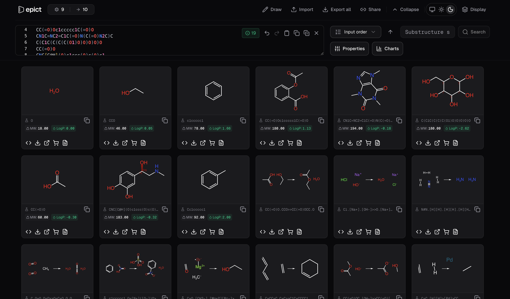
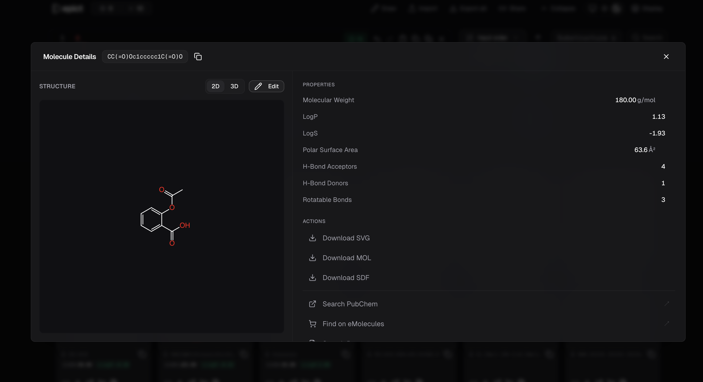
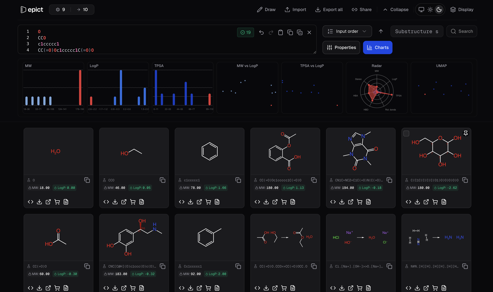
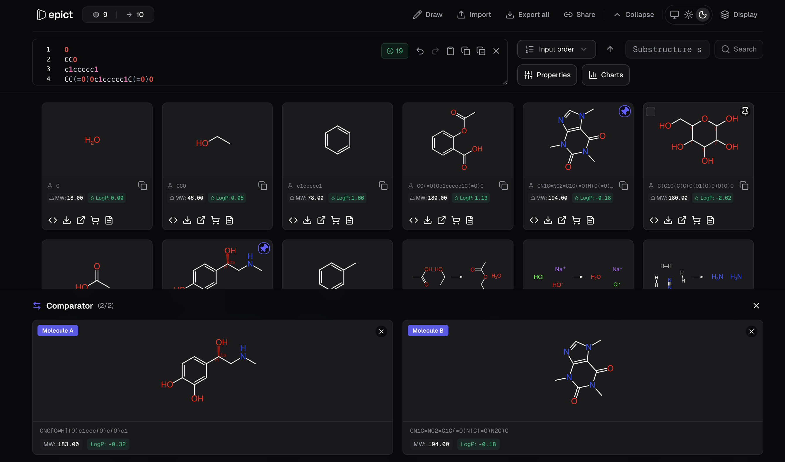

<div align="center">

# <a href="https://d-epict.vercel.app"></a><br />[Depict](https://d-epict.vercel.app)

**Visualize and analyze chemical structures from SMILES**

[](./LICENSE)
[](https://github.com/rschlm/depict/issues)
[](https://www.typescriptlang.org/)
[](https://nextjs.org/)

A modern cheminformatics dashboard for rendering molecules and reactions, computing properties, filtering by substructure or property ranges, and exporting to multiple formats. Designed for clarity, speed, and AI agent integration.

[Quick Start](#quick-start) · [Features](#features) · [Screenshots](#screenshots) · [API](#rest-api) · [Issues](#issues)

</div>

---

## Screenshots

### Main view — molecule grid

<p align="center">
  
</p>

*Paste SMILES, view structures in a responsive grid. Sort, filter, and export.*

---

### Detail panel & properties

<p align="center">
  
</p>

*Click a card to open the detail panel. View properties, copy SMILES/InChI, export MOL/SDF, or open external links.*

---

### Property charts

<p align="center">
  
</p>

*Histogram and scatter plots for MW, LogP, TPSA, and more. Hover for molecule preview.*

---

### Comparator

<p align="center">
  
</p>

*Pin two molecules to compare structures and properties side by side.*

---

## Features

### Input & data

| Feature | Description |
| --- | --- |
| **SMILES input** | Paste molecules or reactions (comma or newline separated). Syntax highlighting in the editor. |
| **Reaction SMILES** | Daylight format (`Reactants>Agents>Products`), multi-step (`>>`), atom mapping (`:1`). |
| **File import** | Drag & drop or click to import MOL, SDF files. |
| **Load sample** | One-click demo data (aspirin, caffeine, benzene, etc.) in empty state. |
| **Paste SMILES** | Empty-state button to paste from clipboard. |
| **Ketcher editor** | Draw and edit structures in-browser; export back to SMILES. |

### Visualization

| Feature | Description |
| --- | --- |
| **2D rendering** | OpenChemLib SVG depiction. Molecules and reactions with configurable arrow style. |
| **3D viewer** | Optional 3Dmol.js structure in detail panel. |
| **Atom mapping** | Highlight mapped atoms in reactions with distinct colors; optional display toggle. |
| **Theme support** | Light and dark mode; depictions adapt to theme. |
| **Responsive grid** | Cards scale with columns; compact mode when many per row. |

### Properties & filtering

| Feature | Description |
| --- | --- |
| **Property calculation** | MW, LogP, TPSA, LogS, rotatable bonds, HBD, HBA, stereo centers. |
| **Substructure search** | Filter by SMARTS or SMILES substructure. |
| **Property filters** | Range sliders for MW, LogP, LogS, TPSA, rot. bonds, HBD, HBA, stereo. |
| **Type filter** | Click molecule/reaction counts to show molecules-only or reactions-only. |
| **Active filter chips** | Removable chips for each applied filter; "+N more" dropdown. |
| **Property charts** | Histogram and scatter plots; tooltips show molecule SVG + value. |

### Sorting & selection

| Feature | Description |
| --- | --- |
| **Sort** | By input order, MW, LogP, TPSA, LogS, rotatable bonds, HBD, HBA, stereo. Ascending/descending. |
| **Drag to reorder** | When sort is "Input order", drag cards to reorder; SMILES input syncs. |
| **Multi-select** | Checkbox on hover, Ctrl/Shift-click. Selection toolbar: Export selected, Add to comparator, Clear. |
| **Select all / Deselect all** | Quick actions in selection toolbar. |

### Export

| Feature | Description |
| --- | --- |
| **Per molecule** | SVG, MOL, SDF from card or detail panel. |
| **Bulk export** | SDF (all), SMI (.smi), CSV (choose columns), SVG (ZIP). |
| **Print / PDF** | Print-friendly view; Save as PDF via browser print. |
| **Copy** | SMILES, MOL, SDF, InChI, InChIKey; per reaction component (RXN). |
| **RXN export** | Download reaction in MDL RXN format (detail panel). |

### Session & sharing

| Feature | Description |
| --- | --- |
| **Session persistence** | SMILES, display options, layout saved to sessionStorage. Restore on reload. |
| **Share link** | Copy link with SMILES encoded in URL; open to preload. |
| **URL state** | Filters, sort, substructure sync to URL; shareable, back/forward works. |

### Detail panel & compare

| Feature | Description |
| --- | --- |
| **Detail panel** | Full properties, actions, external links (PubChem, Patents, eMolecules). |
| **Comparator** | Pin up to 2 molecules; side-by-side comparison bar. |
| **Reaction balance** | Atom balance indicator (Balanced / Unbalanced) for reactions. |
| **Reaxys / SciFinder** | Copy reaction SMILES and open search pages. |

### Utilities

| Feature | Description |
| --- | --- |
| **Remove duplicates** | By canonical SMILES or exact string. Toast with Undo. |
| **Clear** | Clear input with Undo toast. |
| **Keyboard shortcuts** | Ctrl+C/V, Ctrl+Z, Ctrl+H, ? for shortcuts dialog. |
| **Help** | Full-page user guide at `/help`. |

---

## Quick start

```bash
npm install
npm run dev
```

Open **http://localhost:3000**

<details>
<summary><b>Production build</b></summary>

```bash
npm run build
npm start
```

</details>

---

## REST API

For AI agents and automation. Base path: `/api` (relative to deployed URL).

| Endpoint | Method | Purpose |
| --- | --- | --- |
| `/api/parse` | POST | Parse SMILES; returns validation, canonical form, properties |
| `/api/svg` | POST | Generate SVG depiction for molecule or reaction |
| `/api/deduplicate` | POST | Remove duplicate SMILES (canonical or string mode) |

See [app/api/README.md](./app/api/README.md) for request/response schemas.

---

## Tech stack

| | |
| [Next.js 16](https://nextjs.org/) | React framework |
| [OpenChemLib](https://github.com/actelion/openchemlib) | Rendering and chemistry calculations |
| [Ketcher](https://github.com/epam/ketcher) | Structure editor |
| [Zustand](https://github.com/pmndrs/zustand) | State management |
| [Tailwind CSS](https://tailwindcss.com/) | Styling |
| [Radix UI](https://www.radix-ui.com/) | Accessible components |
| [Recharts](https://recharts.org/) | Property charts |

---

## Project structure

```
app/           # Next.js App Router pages and API routes
components/    # React components (cards, grids, panels, UI)
store/         # Zustand store
utils/         # Chem utilities, parsing, export
workers/       # Web workers (property calc, substructure search)
lib/           # Shared helpers, version, session
constants/     # UI constants, samples
hooks/         # useCachedSVG, useMediaQuery
```

---

## Issues

Found a bug, have a feature request, or want to contribute? [Open an issue](https://github.com/rschlm/depict/issues) on GitHub. We welcome bug reports, suggestions, and pull requests.

---

## License

[MIT](./LICENSE)
